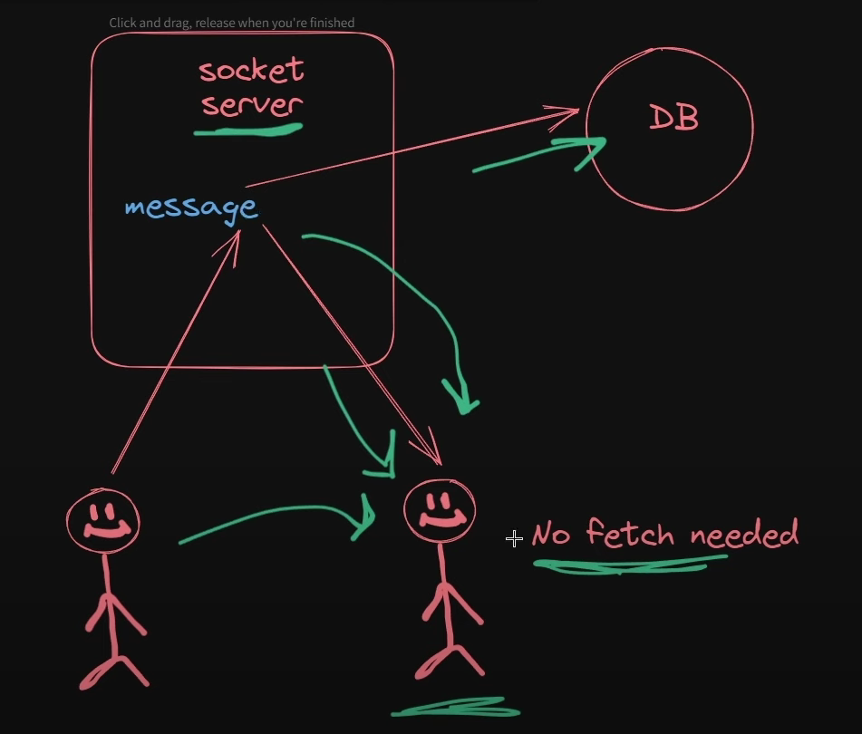
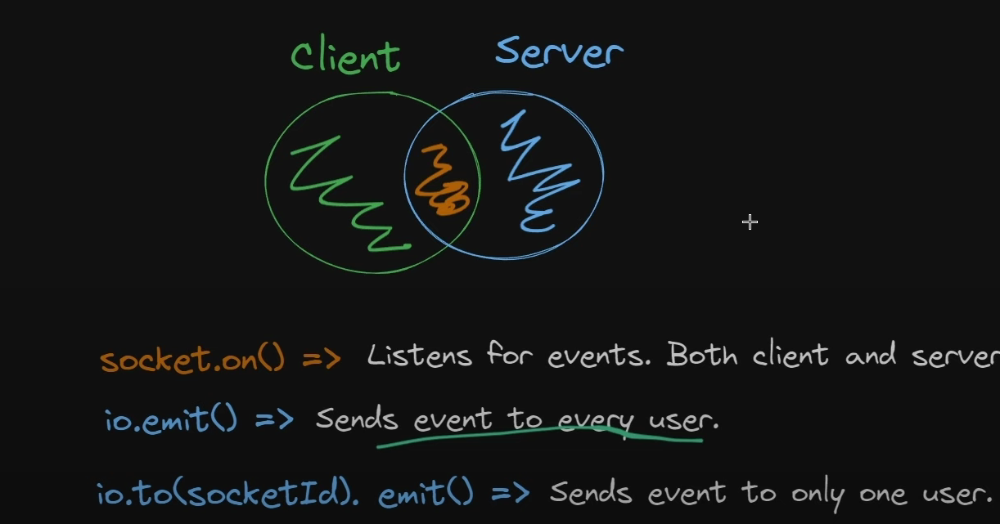
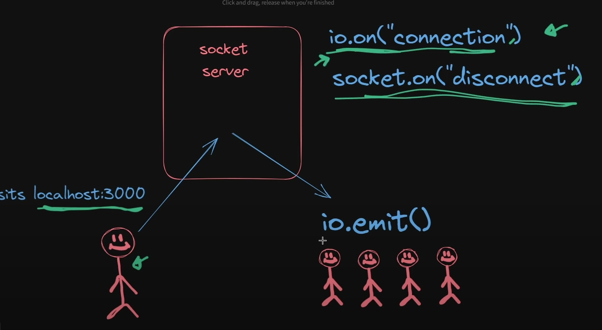

# React + Vite

## w/o using web sockets

Frequent Polling: The client keeps asking the server for new messages very often (e.g., every second).

Server Overload: This constant asking creates a lot of work for the server, even when there are no new messages.

Slow Message Delivery: The client might not get new messages instantly because it only checks periodically.

Inefficient Database Use: The server has to check the database repeatedly, which can slow everything down.

Bad Scalability: As more users join, the server gets overwhelmed with too many requests.

Energy Wastage: The client uses more battery and data because it’s always checking for updates.

## socket server

### What Are WebSockets?
- **WebSockets**: A technology that allows for a continuous, two-way connection between the client and server.
- **Real-Time Communication**: Unlike regular HTTP requests, WebSockets enable instant data exchange without the need for repeated polling.

### How WebSockets Solve the Problem (Based on the Diagram):
1. **No Polling Required**: Clients don’t need to constantly ask the server for updates. Instead, the server sends messages as soon as they are available.
2. **Instant Message Delivery**: Messages are delivered to the receiving client in real-time, as soon as the server gets them, leading to a faster and smoother user experience.
3. **Reduced Server Load**: The server handles fewer requests, as it only sends data when necessary, reducing unnecessary processing and database queries.
4. **Scalability**: The system becomes more efficient and can handle more users without getting overwhelmed.
5. **Happy Users**: Both clients receive messages instantly, making the communication seamless and efficient.

**Socket.io** is a JavaScript library that enables real-time, bidirectional communication between web clients (browsers) and servers. It's commonly used for applications that require instant updates, like chat applications, gaming, live notifications, etc.

### Working of the Diagram:

1. **Client Connection:**
   - A user visits `localhost:3000`, which is the web application hosted locally.
   - This initiates a connection request to the server.

2. **Server Setup:**
   - The server is running a Socket.io instance.
   - The server listens for incoming connections using `io.on('connection')`.

3. **Client-Side Event:**
   - When a user connects, the server acknowledges it, and a `socket` object is created for that specific connection.
   - The server can listen for the disconnection event using `socket.on('disconnect')`.

4. **Emitting Events:**
   - The server can broadcast messages or data to all connected clients using `io.emit()`.
   - This sends the same message to every connected client, which is why there are multiple stick figures on the right side.

### Summary:
- **Socket.io** facilitates real-time communication between a server and multiple clients.
- The diagram illustrates how a user connects to the server, the server handles the connection, and then emits messages to all connected users.